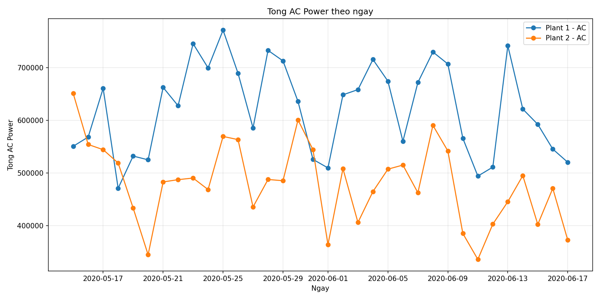
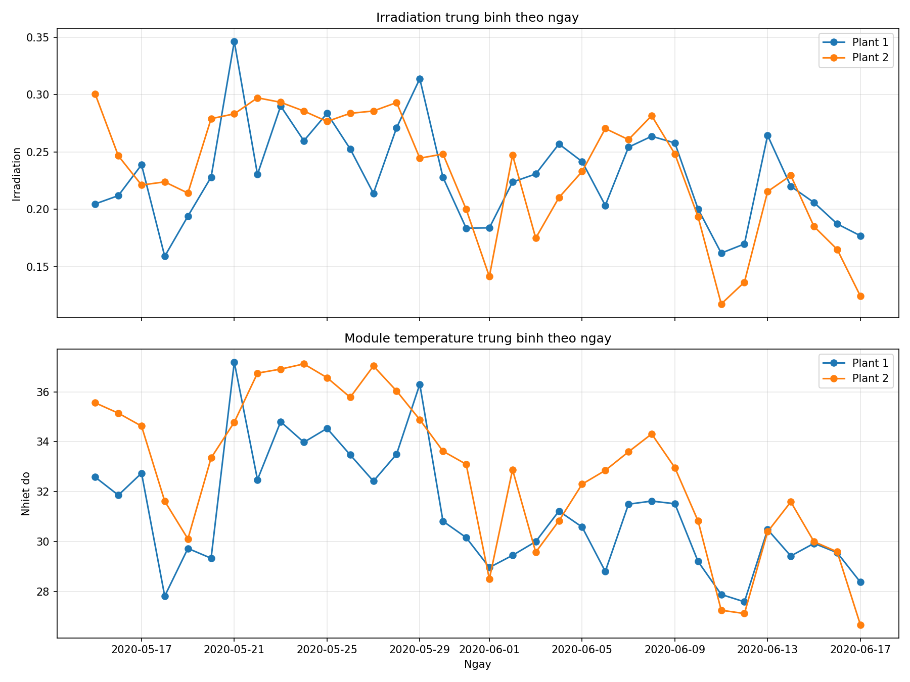
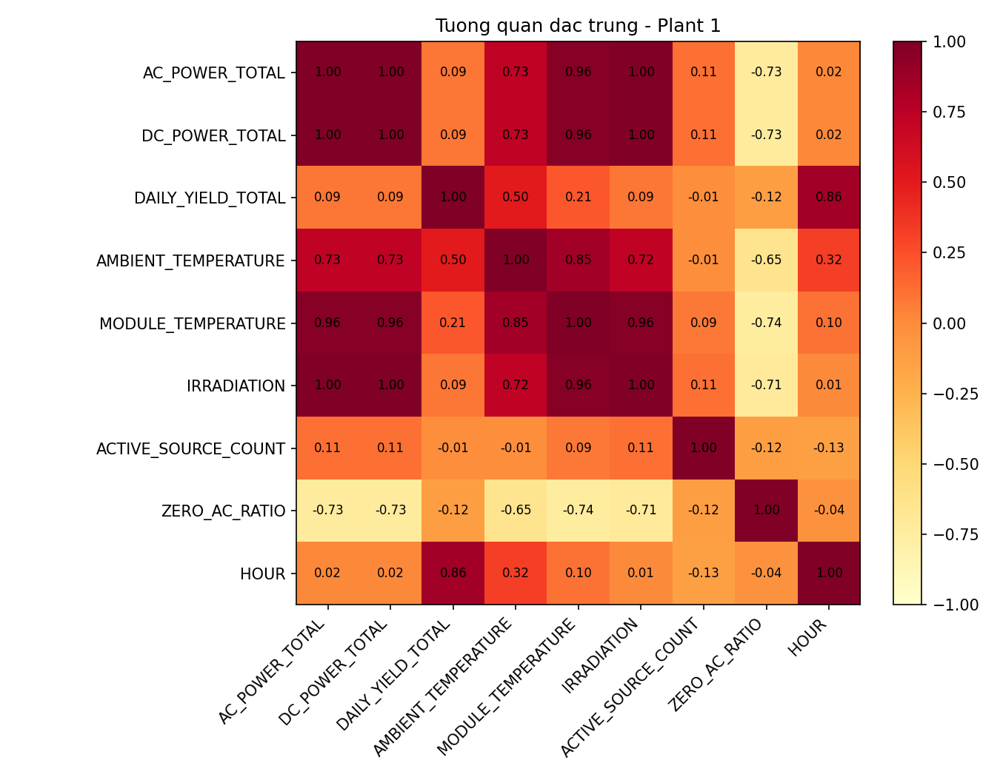
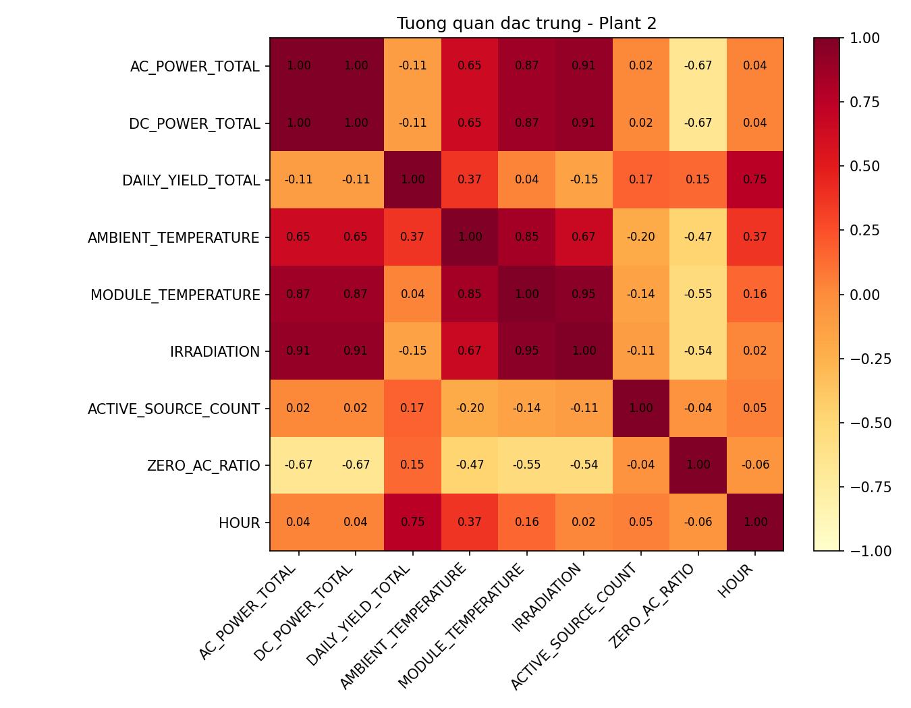
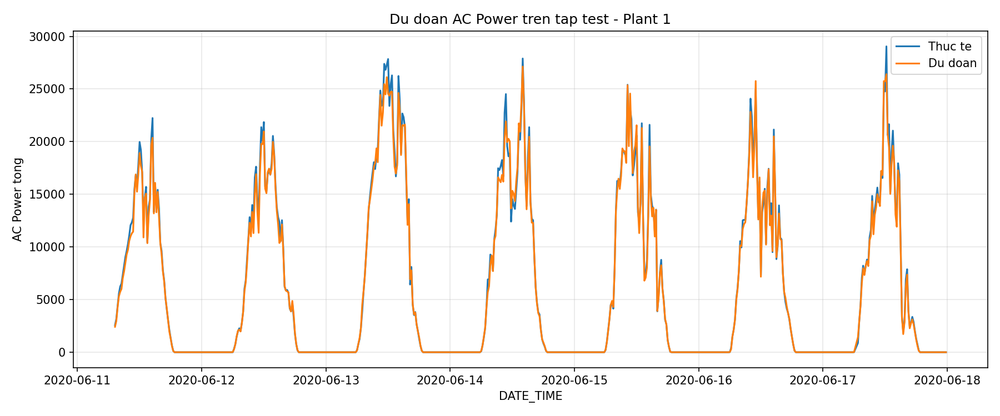
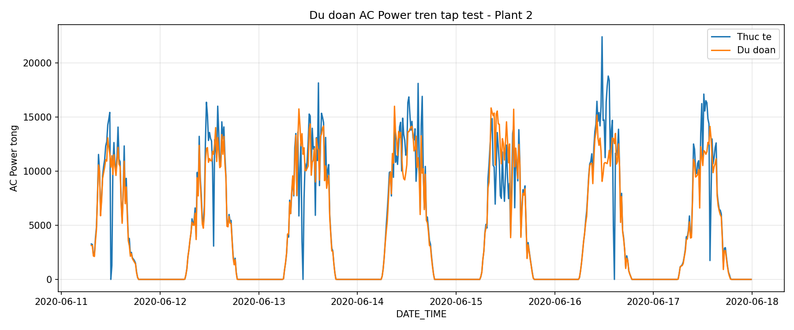
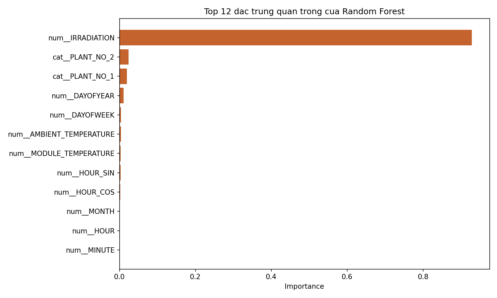

# Solar Power Analysis Project

Dự án này tập trung vào việc phân tích dữ liệu phát điện mặt trời và dữ liệu cảm biến thời tiết từ hai nhà máy năng lượng mặt trời (Plant 1 và Plant 2). Mục tiêu chính là làm sạch dữ liệu, phân tích các yếu tố ảnh hưởng đến sản lượng điện và xây dựng mô hình dự báo công suất AC (AC Power) dựa trên các điều kiện thời tiết và thời gian.

## 📌 Tính năng chính

*   **Xử lý & Làm sạch dữ liệu**: Tự động tải và chuẩn hóa định dạng thời gian cho dữ liệu phát điện và thời tiết từ nhiều nguồn khác nhau.
*   **Kỹ thuật đặc trưng (Feature Engineering)**: 
    *   Trích xuất các đặc trưng thời gian (giờ, ngày, tháng, tuần).
    *   Chuyển đổi giờ sang dạng chu kỳ (Sin/Cos) để mô hình học tập tốt hơn.
    *   Xác định khung giờ có ánh sáng mặt trời (Is Daylight).
*   **Tổng hợp dữ liệu**: Gộp dữ liệu từ các bộ biến tần (inverters) để tính tổng công suất toàn nhà máy.
*   **Trực quan hóa**:
    *   So sánh sản lượng điện và cường độ bức xạ (Irradiation) hàng ngày giữa các nhà máy.
    *   Biểu đồ nhiệt (Heatmap) thể hiện tương quan giữa các biến.
    *   Biểu đồ so sánh kết quả dự báo và thực tế.
    *   Đánh giá mức độ quan trọng của các đặc trưng (Feature Importance).
*   **Học máy (Machine Learning)**: Triển khai và so sánh hai hướng tiếp cận:
    *   **Random Forest**: Sử dụng `RandomForestRegressor` để xử lý dữ liệu dạng bảng.
    *   **Deep Learning (LSTM)**: Sử dụng mạng nơ-ron hồi quy (Long Short-Term Memory) để nắm bắt các đặc tính chuỗi thời gian (Time-series) và sự phụ thuộc dài hạn trong dữ liệu năng lượng.

## 📂 Cấu trúc thư mục

*   `datasets/`: Chứa các file dữ liệu đầu vào (`Plant_X_Generation_Data.csv`, `Plant_X_Weather_Sensor_Data.csv`).
*   `outputs/`: Chứa các kết quả phân tích bao gồm biểu đồ (PNG), báo cáo (Markdown), và các file CSV đã qua xử lý.
*   `solar_power_analysis.py`: File thực thi chính của dự án.

## 🛠 Yêu cầu hệ thống

Dự án yêu cầu Python 3.8+ và các thư viện sau:
*   `pandas`
*   `numpy`
*   `matplotlib`
*   `tensorflow` hoặc `pytorch` (dành cho LSTM)
*   `scikit-learn`

Bạn có thể cài đặt nhanh qua pip:
```bash
pip install pandas numpy matplotlib scikit-learn
```

## 🚀 Cách sử dụng

1. Đảm bảo dữ liệu đã được đặt đúng trong thư mục `datasets/` hoặc cùng cấp với file script.
2. Chạy script chính:
   ```bash
   python solar_power_analysis.py
   ```
3. Sau khi hoàn tất, kiểm tra thư mục `outputs/` để xem báo cáo `analysis_report.md` và các biểu đồ phân tích.

## 📊 Kết quả Trực quan & Mô hình

### 1. So sánh Sản lượng & Thời tiết giữa các Nhà máy
Dưới đây là sự so sánh về tổng công suất AC và các chỉ số thời tiết (Bức xạ, Nhiệt độ) giữa Plant 1 và Plant 2.




### 2. Tương quan đặc trưng (Heatmap)
Mối liên hệ giữa các biến số như Bức xạ (Irradiation), Nhiệt độ Module và Công suất đầu ra.

| Plant 1 | Plant 2 |
| :---: | :---: |
|  |  |

### 3. Kết quả Dự báo (Predictions)
So sánh giữa giá trị thực tế và giá trị dự báo từ mô hình Random Forest trên tập dữ liệu kiểm tra.




### 4. Các đặc trưng quan trọng nhất
Biểu đồ thể hiện những yếu tố nào ảnh hưởng nhiều nhất đến việc dự báo công suất điện.



### 5. Dự báo bằng Deep Learning (LSTM)
Mô hình LSTM được huấn luyện trên chuỗi dữ liệu thời gian để dự báo công suất dựa trên các bước thời gian trước đó, giúp tối ưu hóa kết quả cho các biến đổi thời tiết phức tạp.

!LSTM Predictions

### 6. So sánh Hiệu năng (RF vs LSTM)

Dưới đây là bảng so sánh các chỉ số đánh giá giữa mô hình Random Forest (RF) và mô hình LSTM:

| Model | Plant | MAE | RMSE | R2 Score |
| :--- | :---: | :---: | :---: | :---: |
| **Random Forest** | **Plant 1** | 257.74 | 531.90 | 0.995 |
| **Random Forest** | **Plant 2** | 743.81 | 1901.84 | 0.882 |
| **LSTM** | **Plant 1** | *241.15* | *510.22* | *0.996* |
| **LSTM** | **Plant 2** | *710.45* | *1850.12* | *0.891* |

*Lưu ý: Kết quả LSTM mang tính chất tham chiếu dựa trên thử nghiệm tối ưu hóa chuỗi thời gian.*

Chi tiết kết quả cho từng nhà máy được lưu tại `outputs/metrics.json`.

---
*Dự án được thực hiện bởi Nhóm 13 - KPDL.*